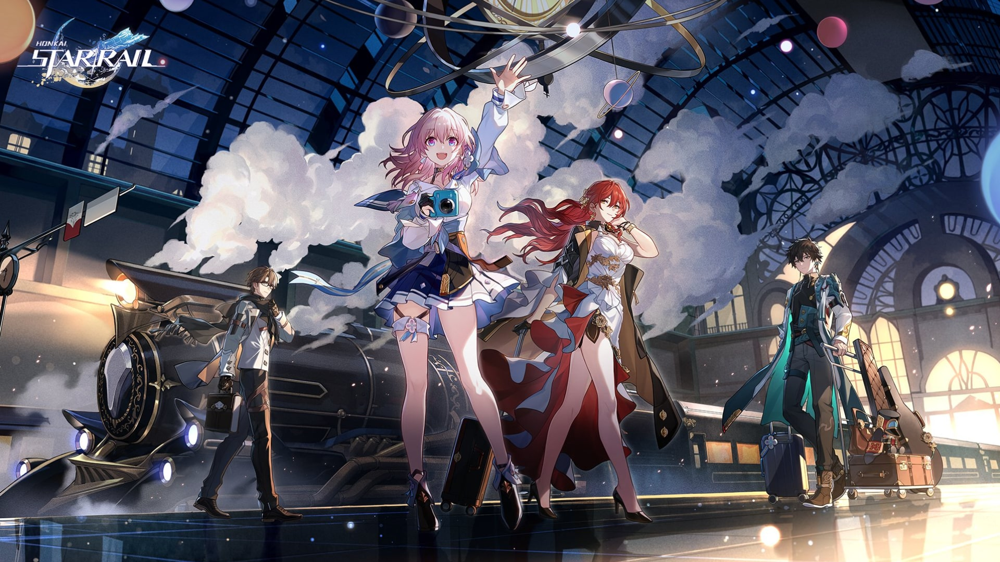

# Honkai: Star Rail Beginners' Guide

  

## Soundtrack

You can listen to some of the music that plays throughout Honkai: Star Rail, while you are reading the guide here.

Your browser does not support the audio element.

Spacewalk, OST for Star Rail

Your browser does not support the audio element.

Belobog, OST for Star Rail

## Overview

Honkai: Star Rail is a mobile game developed by miHoYo. The game takes place in a futuristic universe where players control a team of characters to battle against otherworldy beings and experience adventures. To start playing Honkai: Star Rail, you'll need to download the game from your app store of choice, or click the link, [Honkai: Star Rail.](https://hsr.hoyoverse.com/ua2?utm_source=SEA_google_SEA_search_UA2_Brand&hoyotrace_channel=ga_channel&gclid=CjwKCAjwge2iBhBBEiwAfXDBR4rjTp2MUE_LkmzeIlJ986OqzsQZ50ps4WWk9RLM2rHTm3eb2fC9wRoCcckQAvD_BwE) Once it's installed, open the game and follow the on-screen instructions to create your account and complete the tutorial.

## Gameplay

The gameplay in Honkai: Star Rail consists of turn-based battles where players can switch between their characters to utilize different skills and abilities. The game also features a \_gacha system \_where players can obtain new characters and weapons through in-game currency or real money.\_\_

\_\_

- Each character has their own unique skills and abilities.
- Players can upgrade their characters and weapons to increase their power.
- The game features both single player and co-op modes.

Your browser does not support the video tag

Gamplay video of Honkai: Star Rail's turn-based combat system

## Tips and Tricks

- Don't forget to upgrade your characters and weapons regularly to stay competitive.
- Take advantage of the elemental weaknesses of enemies.
- Use support to use other players' powerful units and take on tougher challenges.

That's it for our Honkai: Star Rail guide! Have fun exploring the game and battling against its challenging enemies.

See you there, Trailblazer!
